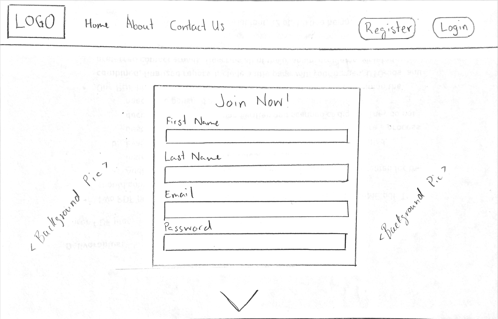
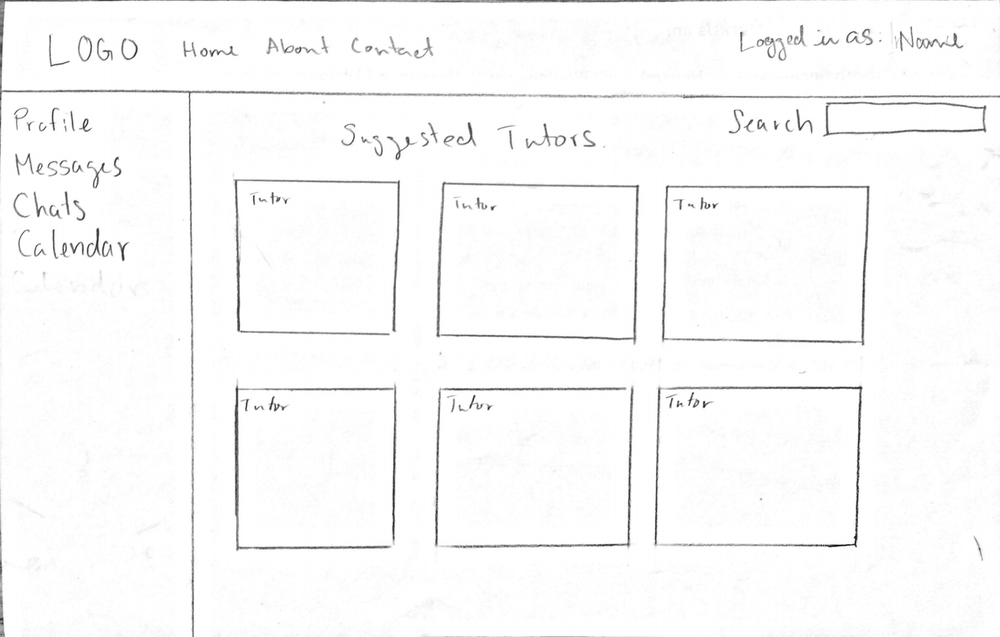
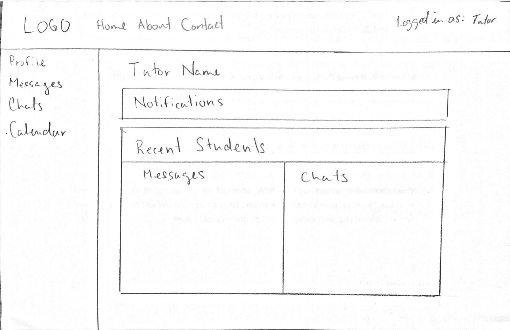
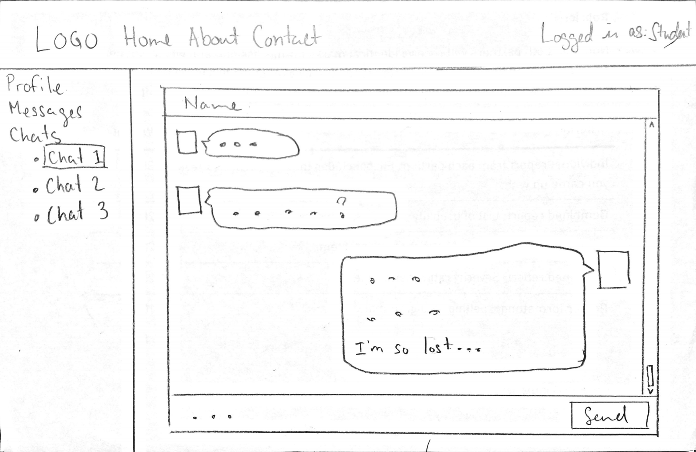
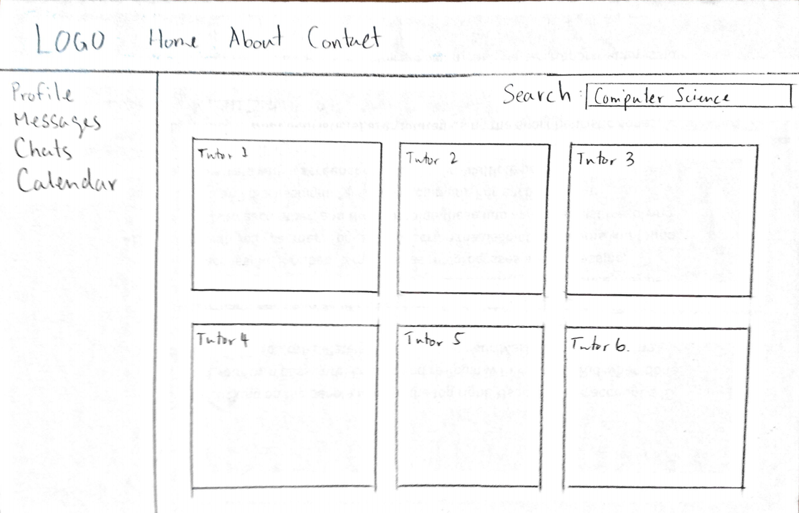

CSC309 - Project Proposal
=========================

Application Description
-----------------------

Our web application will be a tutoring/mentoring service where students can sign
up and get help in different subject areas from tutors who have experience in
that specific subject area. Upon logging in, students will be able to search for
tutors based on a specific subject (or by name), and open a chat dialog with
them, send them private messages, or continue conversations from previous
messages. When students have received help with their work, they can rate the
experience they had with the particular tutor to provide feedback for future
students. Once tutors have enough ratings they will have the option of offering
a paid service to students to give them an incentive to provide the best
tutoring possible.

User Interactions
-----------------

Administrators can:
* Interact directly with the database using a web interface to perform tasks
  such as create new users, modify existing users, viewing usage statistics
* Perform administrative tasks such as reviewing the qualifications of tutors,
  or handling tutor profiles with poor performace.

Tutors can:
* Register an account with the website, and login to the website.
* Edit their profile including personal information, tutoring qualifications,
  updating passwords, etc.
* View notifications for events, such as upcoming calendar events, private
  messages from students, or other tutors.
* Participate in chats with students both individual and in a group.
* Send and view private messages.
* Schedule calendar events with students.

Students can:
* Register an account with the website, and login to the website.
* Edit their profile including personal information, current learning interests,
  updating passwords, etc.
* View notifications for events, such as upcoming calendar events, private
  messages from tutors or other students, etc.
* Participate in chats with students both individual and in a group.
* Rate tutors based on their performance.
* Send and view private messages.
* Schedule calendar events with tutors.

Additional Features
-------------------

* Email notifications
* Facebook/Google login
* Calendar event management with Google API
* Real time chat service

Sketches
--------

Landing Page:

Student Main Page:

Tutor Main Page:

Chat Window:

Search:

